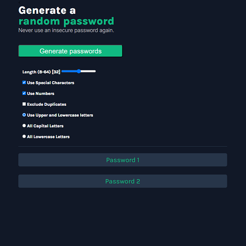
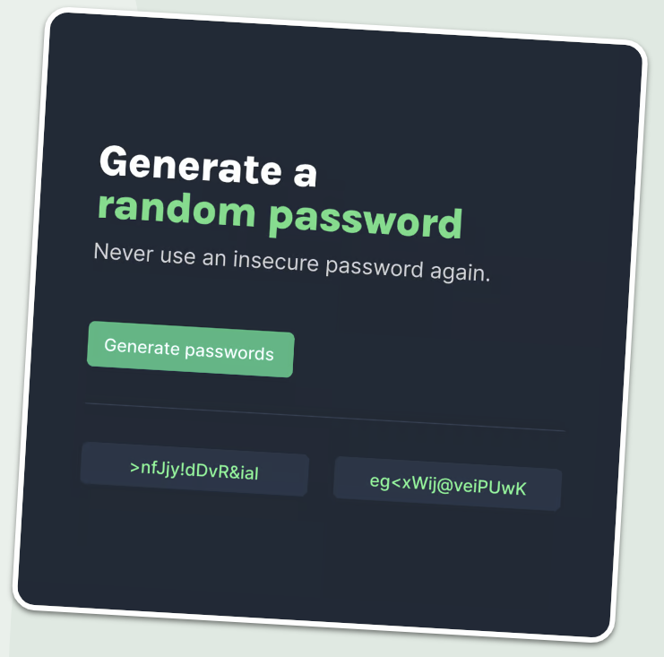

# password-generator

## Project Overview 

This is a website for generating highly-customizable passwords to provide users with the reassurance that secure passwords offer.

## Features

__Requirements:__  
- Build it from "scratch" (Figma file provided as well as some limited code including an array with characters)
    - Generate Password button
    - Two fields for displaying the two passwords
- Generate two random passwords when the user clicks the button
- Each password should be 15 characters long
- Design files were provided for both a light option for the page color scheme

__Stretch Goals:__  

- Set password length
- Add "copy-on-click" functionality
- Toggle symbols and numbers on/off

 

**My Implementation:** 

- I started by replacing all of the text and image content on the original site with information about myself and my hometown
- Hover funcationality was added to highlight each attraction as clickable
- New pages were added to contain detailed information about each attraction
- Return navigation was added to content pages that also utilized hover functionality
- The "Fire Sans" Google Font was added to the page
- Several color palettes at Coolors.co were considered but none matched the blues and greens of my source images as well

## Challenges and Learning

### Hover Text ("Click to Copy")

- One earlier suggestion for making the text "click to copy" appear where the result paragraphs are generated was to change the "visibility". Unfortunately, issues came up where the browser refreshed the paragraph rapidly, resulting in a flickering paragraph
- The entire paragraph was vanishing until the span was added and the class styling was moved to the div instead of the paragraph. The target for the hover CSS was updated to the new span. This fixed an issue where the "Click to Copy" text wasn't displaying at all
- I briefly sturggled getting the styling for the two paragraphs to align but I found that my ID selector for one of them was missing the #
- There were some alignment issues but those were fixed by updating the class to use some flexbox and setting things like position: absolute, the top let and transform attributes as well

### Click to Copy Functionality

- The event listener for clicking ont he paragraphs was hardley ever working
- With a suggestion from ChatGPT, I added some global logging to identify the target of every single click event.
    - This helped me to realize that the Span was being targeted, not the paragraph.
    - This lead to me changing the target for the event to the parent container
        - This allowed for clicking anywhere in the space instead of the small text area
        - If we only targeted the paragraph, the hover would trigger before the pointer was over the password and clicking would have no effect
    - As part of the solution, I added IDs to the parent divs for each paragraph in the HTML file and then replaced the event listener with one targeting the parent div's new ID
    - One way to prevent the span from stealing clicks was to add some CSS to the span (pointer-events: none;)
- Key learning: When click logging seems inconsistent, try logging the target of all clicks to learn more
- Key learning: The concept of "event bubbling" came up and I studied it briefly to grasp the relevant concepts better

### Paragraph Appearance

- With some assistance from ChatGPT, I opted to setup the paragraphs with "word-break" set to "break-all" which really helped the overflow behavior when screen sizing was adjusted
- I also set the height to a min-height rather than 100% which helped the paragraph to expand vertically to encompass the larger passwords on smaller screens
- Key Learning: At least in this instance, word-break set to break-all was more effective than overflow-wrap set to break-word as that appeared to have no influence over my page

### Variables

- At one point, I found that I was getting a lot of unexpected duplicate characters and it was because I was targetting the existing passwords for comparison when I should have been targetting the (temp) password under construction. This was a good reminder to check my variables and make sure that I am using the correct ones at the correct times

### CSS Cleanup

- I was advised to use adjustable widths rather than absolute values for responsiveness
- I made an effort to streamline CSS by elevating references to fonts to the most common part of my CSS- cutting down on repeated references
- I learned how to use CSS variables for things like holding color values (something that will help me down the road when I experiment with different color or light/dark modes)
- I was reminded of the importance of setting up fallback fonts when using external fonts like Google fonts
- I was reminded that font-weights don't require a unit type like px
- Using line height instead of just height is more adaptable

### Efficiency in Using AI

- I sped up my process with a few tasks while writing this site
    - Converting checkboxes to radio buttons in a series
    - Figuring out how to change default state of a checkbox/radio button
    - Getting started on connecting my form inputs to the JavaScript for manipulation in my code (turned out to be easier than I thought after my initial Google search results had me a bit confused)

### Code Review Notes

- There is a way to allow the click-to-copy feature to function within Scrimba but it requires using a deprecated feature (exec command method) and this problem should not occur outside of Scrimba
- Suggestion to make the radio buttons for selecting uppercase/lowercase options a dropdown menu to save space. It becomes more obvious on mobile devices what is happening when more of the page is visible in a smaller space
- Advised to let a button occupy space on its own rather than have the width grow (This was something that I was playing around with as a means to fill larger screens but I can definitely see advantages to keeping the button size only as big as the text and padding requires)
- Add a max-width to the body advised (if this affects the background color, this could alternatively be applied to the header, main, and footer). The point is brought up that there is a point of diminishing returns when expanding content because noone really wants to look at the far corners of a larger monitor to take in website content.
- Recommended to declare variables as const instead of let when possible (this is something that I did learn and forgot on multiple projects so it has been noted mentally as well as in my own resources as a quick-reminder tool for finalizing projects)
- Recommended to split each type of password piece into it's own array (number, capital, lowercase, special) and then to compile the valid characters into a single array which is randomly drawn from
    - This eliminates the need to check if each character is valid because any character in the compiled array is valid
    - Saves on iteration effort
    - Simplifies the code
    - Makes it more clear what is being worked with based on which arrays are targeted for the compiled array

Positive Feedback

- Going above and beyond with features
- Including accessibility features like arias
- Trying to include SEO, Open Graph, and Meta tags
- Comments for every function
- Code is well structured

## Installation
Install the dependencies and run the project

npm install 
npm start 
Head over to https://vitejs.dev/ to learn more about configuring vite

## Contributing
Feel free to fork this project and submit pull requests. You can also open issues for any bugs you find or enhancements you think would be useful.

## Authors
John Okleberry - [Github profile](https://github.com/John-Okleberry)

About Scrimba
At Scrimba our goal is to create the best possible coding school at the cost of a gym membership! 💜 If we succeed with this, it will give anyone who wants to become a software developer a realistic shot at succeeding, regardless of where they live and the size of their wallets 🎉 The Frontend Developer Career Path aims to teach you everything you need to become a Junior Developer, or you could take a deep-dive with one of our advanced courses 🚀

Our courses
The Frontend Career Path
Become a Scrimba Pro member
Happy Coding!
